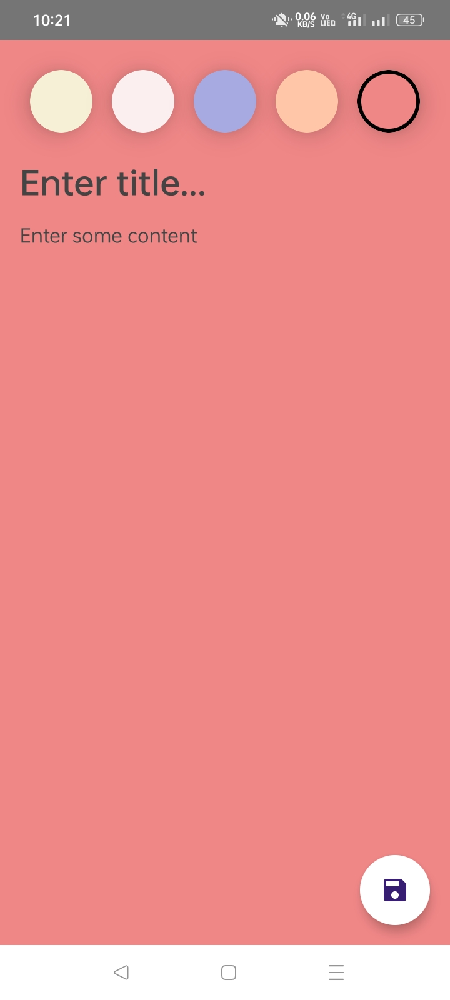
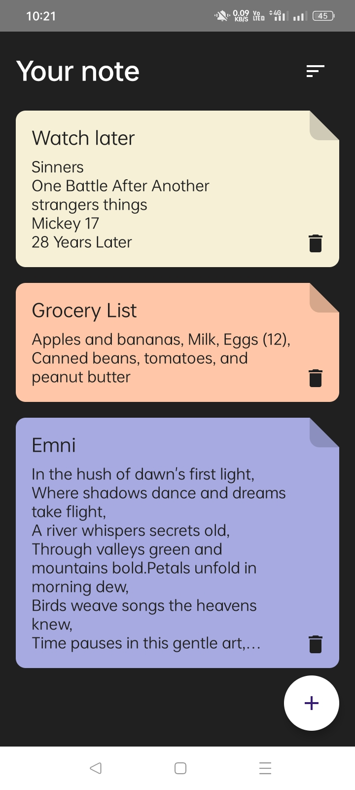

# Noteghty

**Noteghty** is a modern Android note-taking application designed to deliver a simple, fast, and intuitive experience for creating and managing notes. Built with **Android Studio** and **Jetpack Compose**, the app follows clean and maintainable Android development practices suitable for both learning and production-ready projects.

---

## Download

<p align="center">
  <a href="https://github.com/AbrarShakhi/noteghty/releases">
    
  </a>
</p>

---

## Overview

Noteghty focuses on simplicity, usability, and performance. It is ideal for users who want a lightweight note-taking app and for developers looking to explore modern Android UI development using Jetpack Compose.

---

## Features

* Create, edit, and delete notes
* Clean, minimal, and intuitive UI
* Fast performance with local data storage
* Lightweight and responsive design
* Supports Android 10 and above

---

## Tech Stack

* **Language:** Java / Kotlin
* **IDE:** Android Studio
* **Platform:** Android
* **UI Framework:** Jetpack Compose
* **Architecture:** Standard Android app architecture

---

## Screenshots

<p align="center">
  
  &nbsp;&nbsp;
  
</p>

---

## Getting Started

### Prerequisites

* Android Studio (latest stable version recommended)
* Android SDK
* Android Emulator or physical Android device
* Minimum Android version: **Android 10 (API 29)**

### Installation

1. Clone the repository:

```bash
git clone https://github.com/AbrarShakhi/noteghty.git
```
2. Open the project in **Android Studio**
3. Allow Gradle to sync dependencies
4. Run the app on an emulator or connected device

---

## Testing

* Tested on Android emulator and physical devices
* Compatible with multiple screen sizes and resolutions

---

## Contributing

Contributions are welcome!
Feel free to fork this repository and submit a pull request with improvements, bug fixes, or new features.

---

## License

This project is licensed under the **Apache License 2.0**.
See the [LICENSE](LICENCE) file for details.

## Credits

* <a href="https://www.flaticon.com/free-icons/paper" title="paper icons">Paper icons created by Pixel perfect - Flaticon</a>